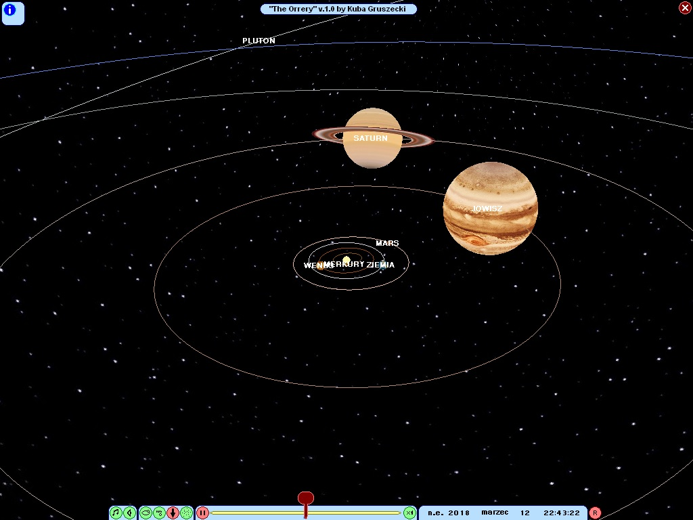

# The Orrery

3D simulation in OpenGL of a solar system I made in 2007 for some classes at university. I knew little about programming back then so the code is of poor quality, containing tons of polish comments (to convince my teacher that I know what I'm doing), lots of repetitions and squeezing everything into exactly one file. Enitre UI is in polish but it's easy to figure it out. And hey, it still launches on Windows 10!

Despite the quality of code the simulation had a few cool features:
* Shows accurate positions of planets between 3000 BCE and 3000 CE.
* Rotation and tilt of planet's axis is also accurate.
* You can set any date you want.
* You can choose the speed of time flow to see the planets in motion.
* Pluto!

Note: Sun, planets (and dwarf planet) are not up to scale.

## Julian days

The equations to calculate the position of the planets take time as a parameter in a Julian days. Julian day is a continuos count of days used in astronomy. More on that here:

https://en.wikipedia.org/wiki/Julian_day

## Credits (kinda)

I used several works of other people in this software:

* algorithm to calculate julian day from gregorian calendar
* equations to calculate position of planets
* planet textures
* sounds and music

I wish to acknowledge people responsible for the above but I completely lost the sources over the years years.

## Requirements

Any Windows will do.